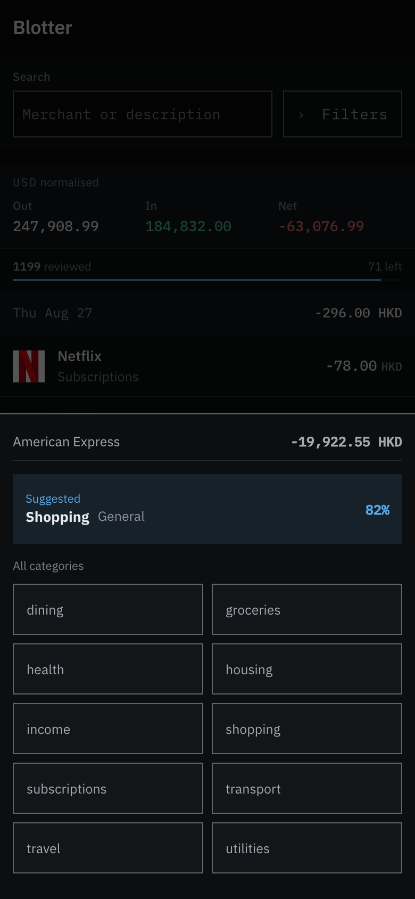
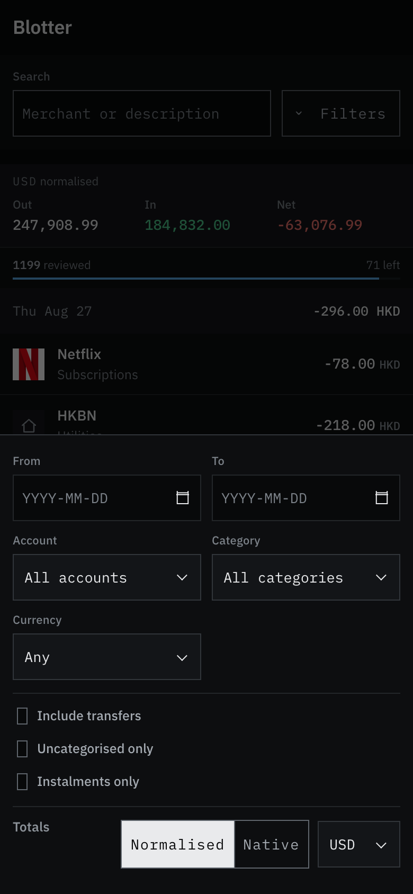
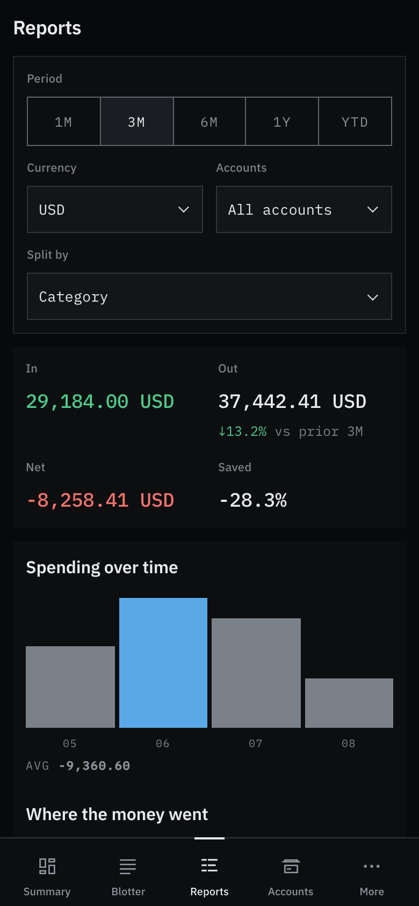
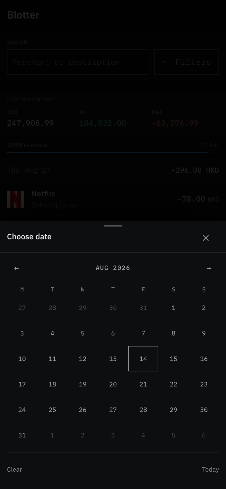
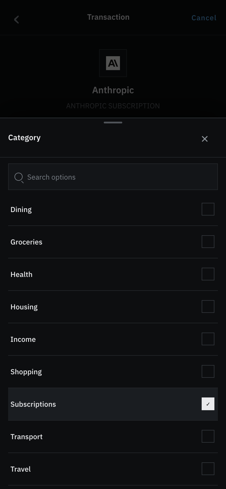

# Mobile experience

Finto's compact layout is a financial ledger shaped for a thumb, not a desktop
table squeezed into 390 pixels. It keeps the square, data-dense visual thesis
while using surface, hierarchy, and progressive disclosure to reduce chrome.

## Product hierarchy

- **Summary answers the daily question.** The primary figure is spend this
  month compared with the same elapsed period last month. Income, net, and
  savings rate support it; longer-range flow stays below.
- **Accounts owns financial position.** Net worth sits with the assets and
  liabilities that explain it, ahead of the account hierarchy.
- **Blotter is a reviewable queue.** Merchant is the dominant line, category is
  quiet, the amount is right-aligned, and currency appears only for exceptions.
  A progress line supplies the denominator.
- **A transaction opens as a mobile detail screen, not a squeezed inspector.**
  Merchant, booked amount and currency lead; native charge and exchange rate
  stay adjacent. Editable annotations follow the ordinary facts. Original
  statement fields and provenance remain available under one disclosure.
- **Classification assists; it does not decide.** The picker leads with a
  confidence-gated cached/model suggestion. The ledger changes only after a
  tap, which records a manual confirmation.

## Interaction rules

- Compact controls have at least 44px height. Selects and calendars become
  bottom sheets with a scrim, explicit close target, safe-area padding, and
  keyboard dismissal.
- Currency sheets show both the ISO code and localized currency name, expose
  search, and use a persistent selected mark. Generic long option lists inherit
  the same search and selection treatment.
- The five mobile tabs are equal top-level destinations: Summary, Blotter,
  Reports, Accounts, and More. Review is episodic work under More; its pending
  state is still visible on the More tab.
- Recent dates use Today, Yesterday, and localized weekday/month labels. The ISO
  date remains available as a title for precision.
- Ordinary spending is neutral. Green denotes money in or improvement; red is
  reserved for exceptional negative state. Status also has text or shape so
  colour is never the only signal.
- Chart and route motion uses the system duration/easing tokens and is disabled
  under `prefers-reduced-motion`.

These choices follow Apple's guidance on [layout](https://developer.apple.com/design/human-interface-guidelines/layout),
[lists and tables](https://developer.apple.com/design/human-interface-guidelines/lists-and-tables),
[tab bars](https://developer.apple.com/design/human-interface-guidelines/tab-bars),
[writing](https://developer.apple.com/design/human-interface-guidelines/writing),
[sheets](https://developer.apple.com/design/human-interface-guidelines/sheets),
[charts](https://developer.apple.com/design/human-interface-guidelines/charts), and
[motion](https://developer.apple.com/design/human-interface-guidelines/motion).
Colour is backed by the WCAG rule that it must not be the sole visual means of
conveying information.

## Visual QA

`web/scripts/capture-mobile.mjs` is the repeatable acceptance check. Against a
populated local ledger it:

1. signs in and captures the core views at 390×844 @2x;
2. fails on page-level horizontal overflow or visible controls below 44px;
3. verifies currency names/search and select/date sheet anchoring;
4. opens a transaction, audits its full-screen detail and statement disclosure;
5. asserts the stable five-tab information architecture;
6. repeats overflow checks at 1280×800; and
7. confirms chart animation is disabled for reduced-motion users.

Run `npm --prefix web run capture:mobile` to refresh the images, or
`npm --prefix web run test:mobile-ux` for assertions without file writes.

## Current screens

| Summary | Reviewable ledger |
|---|---|
|  |  |

| Suggested category | Bottom-sheet control |
|---|---|
|  |  |

| Filters | Accounts and net worth |
|---|---|
|  |  |

| Reports as a top-level destination |
|---|
|  |

| Calendar sheet |
|---|
|  |

| Transaction detail | Category control in context |
|---|---|
|  |  |

| Statement data and provenance |
|---|
|  |
