# Mobile experience

Finto's compact layout is a financial ledger shaped for a thumb, not a desktop
table squeezed into 390 pixels. It keeps the square, data-dense visual thesis
while using hierarchy, surface, and progressive disclosure to reduce chrome.

## Product hierarchy

- **Summary answers the daily question.** Month-to-date spend and its
  like-for-like comparison lead. Income, net, savings rate, and longer-range
  flow support it.
- **Blotter is a ledger, not a review queue.** Merchant, category, and amount
  form a consistent scan line. Only exceptional states get a marker. Matching
  suggestions are an occasional utility in More, never a tab or ambient badge.
- **Accounts owns financial position.** Net worth leads to consistently aligned
  institution rows. Products with multiple subaccounts have their own aggregate
  page; every subaccount and standalone account has a dedicated detail page.
  Those pages collect balance, transaction count, cardholders, top spending,
  money flow, monthly outflow, structure, and recent activity without repeating
  empty analytics.
- **Reports owns analysis.** Charts are placed beside the summary they explain,
  remain dense at both breakpoints, and reveal once when they enter the scroll
  viewport. Reduced Motion produces the complete static chart immediately.
- **Transaction detail is a page on mobile.** Merchant and booked amount lead;
  native charge and exchange rate stay adjacent. Editable annotations follow
  the ordinary facts. Original statement fields and provenance remain available
  under one disclosure.

## Interaction and visual rules

- The five mobile tabs are stable top-level destinations: Summary, Blotter,
  Reports, Accounts, and More. A tab navigates; it is not a status light or an
  action shortcut.
- Compact interactive targets are at least 44px. Selects and calendars become
  bottom sheets with a scrim, explicit close target, safe-area padding, search
  where useful, and keyboard dismissal.
- A currency row contains two complementary facts: ISO code and localized name.
  The selected checkmark communicates state; the code is not repeated as
  secondary copy. On mobile, Converted/Native and reporting currency live in a
  compact **Options** sheet; on desktop they remain inline beside the totals.
  Both stay separate from transaction filters.
- The app has one vertical page scroller. Subviews never inherit the previous
  route's offset. Subtle scroll-edge fades communicate that content continues
  and disappear exactly at the top or bottom. Horizontal chart exploration is
  allowed inside the vertical page and uses an explicit cue.
- Persistent navigation is excluded from route snapshots; changing pages never
  hides or fades the mobile tab bar or desktop sidebar. A sheet owns every
  gesture that begins inside it, including downward movement at its top edge,
  so pull-to-refresh remains a page-only action.
- A single-choice selector uses one trailing check with no checkbox container.
  Select, filter, calendar, category, and account sheets scroll independently
  and use contained overscroll so reaching an edge does not refresh the page.
- Typography uses shared responsive tokens; labels are sentence case, figures
  and codes use mono only when alignment carries meaning, and reading sizes step
  up on compact screens. Spacing uses the shared scale; cards do not stretch to
  match unrelated grid neighbors or retain empty desktop height on mobile.
- `--bg`, `--panel`, `--panel-2`, and hairlines express permanent hierarchy.
  Translucency and backdrop blur are reserved for chrome that actually floats
  over content — tab bar, menus, sheets, calendars, and drawers — and pair with
  a scrim for an unambiguous z-axis. Ordinary cards remain opaque, so material
  continues to mean elevation instead of becoming decorative noise.
- Settings contains user-controlled preferences and account access, not system
  diagnostics or duplicate task links. Destructive session actions stay with
  identity; specialist API access is collapsed until requested. Copy names the
  control or state and does not explain an obvious effect back to the user.
- Merchant/issuer marks use a real brand asset when one exists and a consistent
  semantic fallback otherwise. Flags are not used for currencies: a currency is
  not reliably identical to a country.
- Ordinary spending is neutral. Green denotes money in or improvement; red is
  reserved for exceptional negative state. Status also has text or shape, so
  colour is never the only signal.
- Motion is brief and purposeful, never blocks input, runs only on first entry,
  and is disabled under `prefers-reduced-motion`.
- Reveal-on-entry charts have a stable hidden first frame and an explicit visible
  final frame; asynchronous layout can never flash a complete chart and then
  remove it. Mobile transaction detail uses detached Back and Edit controls over
  the surface instead of spending vertical space on a fixed top bar.

These choices follow Apple's official guidance on [layout](https://developer.apple.com/design/human-interface-guidelines/layout),
[lists and tables](https://developer.apple.com/design/human-interface-guidelines/lists-and-tables),
[tab bars](https://developer.apple.com/design/human-interface-guidelines/tab-bars),
[scroll views](https://developer.apple.com/design/human-interface-guidelines/scroll-views),
[sheets](https://developer.apple.com/design/human-interface-guidelines/sheets),
[materials](https://developer.apple.com/design/human-interface-guidelines/materials),
[settings](https://developer.apple.com/design/human-interface-guidelines/settings),
[disclosure controls](https://developer.apple.com/design/human-interface-guidelines/disclosure-controls),
[charts](https://developer.apple.com/design/human-interface-guidelines/charts),
[motion](https://developer.apple.com/design/human-interface-guidelines/motion), and
[accessibility](https://developer.apple.com/design/human-interface-guidelines/accessibility).

## Acceptance matrix

`web/scripts/capture-mobile.mjs` is the repeatable visual acceptance check. Run
`npm --prefix web run capture:mobile` to validate and refresh images, or
`npm --prefix web run test:mobile-ux` for assertions only.

| Concern | Automated evidence |
|---|---|
| Mobile sizing | Every core route at 390×844 @2x; no page overflow; every visible control ≥44px |
| Desktop preservation | Core, settings, group, and account detail routes at 1280×800; no horizontal overflow |
| Theme hierarchy | Summary, Accounts, and Settings captured in both dark and light themes |
| Selector quality | Sheet owns viewport bottom; has search, names, one code occurrence, selected mark, and dismiss target |
| Navigation | Exact five-tab order; no Review tab; routed account pages reset to scroll top |
| Ledger semantics | No review progress or completion chrome; filters and amount display remain separate |
| Detail/data viewer | Full-screen mobile transaction detail, currency, 44px back target, statement-data disclosure, and no overflow |
| Account symmetry | Standalone and grouped headers differ by no more than 1px; group, subaccount, and standalone detail pages are exercised |
| Scroll feedback | Top/bottom edge state is asserted at both extremes |
| Chart behavior | Below-fold chart waits for intersection, animates on entry, and becomes static under Reduced Motion |
| Material hierarchy | Currency and Options sheets expose active backdrop blur; content surfaces remain opaque |
| Settings relevance | No storage engine, connection status, workspace group, or duplicate Import link; API access starts collapsed |
| Navigation continuity | Root and persistent navigation opt out of route snapshots; only routed content has a transition name |
| Sheet gesture ownership | Overflowing selector scrolls; contained gesture leaves pull-to-refresh at rest |
| Selector semantics | Selected single-choice row has an unboxed trailing check |
| Chart stability | Donut is hidden before intersection and completes to visible on reveal |
| Transaction actions | Mobile title bar is absent; detached Back and Edit targets remain at least 44px |
| Desktop transaction actions | Mobile Back is absent; title, Edit, and Close share one compact aligned row |

## Current screens

| Summary | Ledger |
|---|---|
| 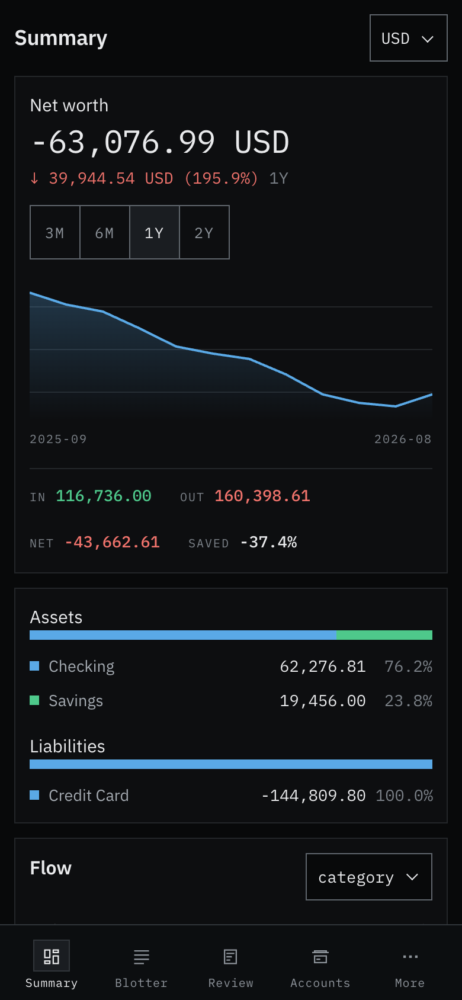 | 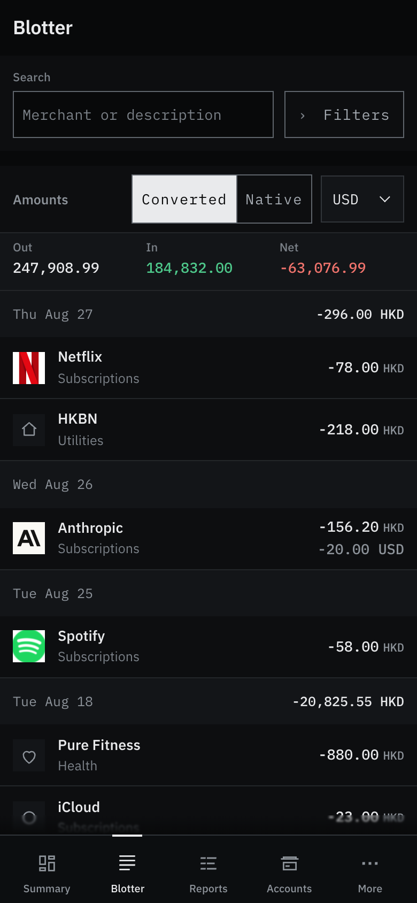 |

| Currency selector | Display options |
|---|---|
| 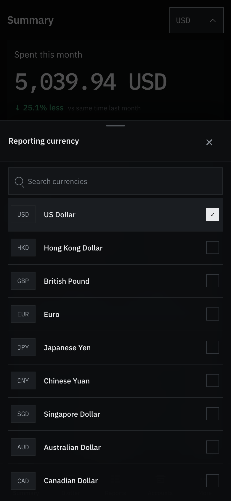 | 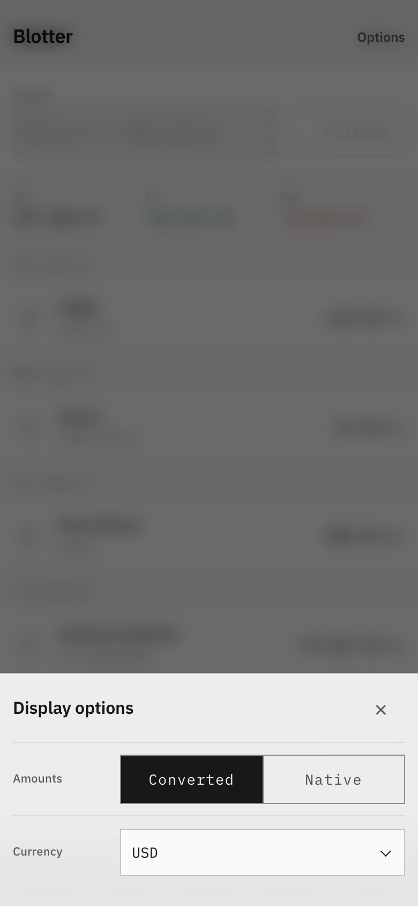 |

| Transaction detail | Statement data and provenance |
|---|---|
| 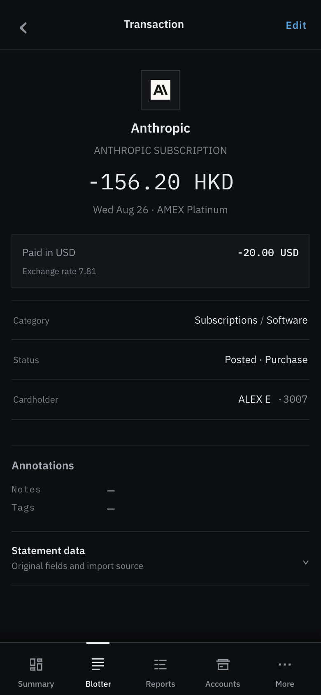 | 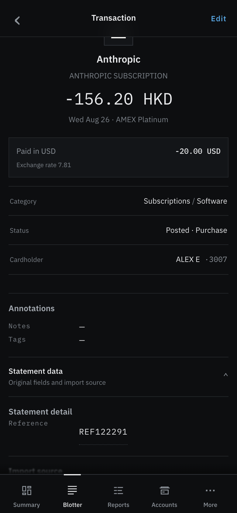 |

| Accounts overview | Product aggregate |
|---|---|
| 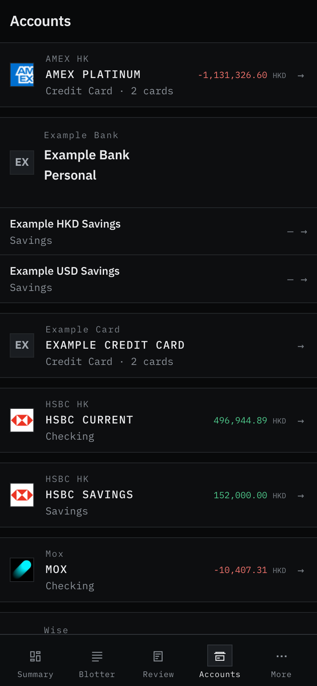 | 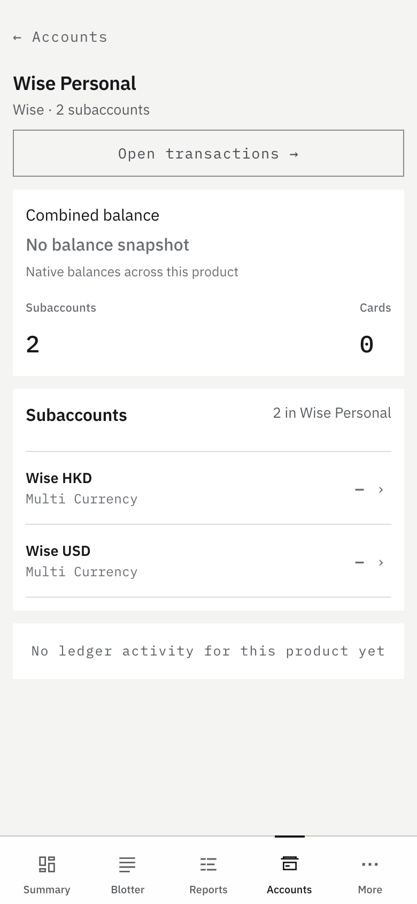 |

| Standalone account | Subaccount |
|---|---|
| 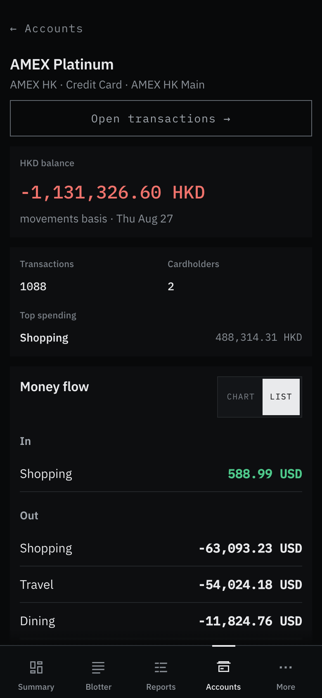 | 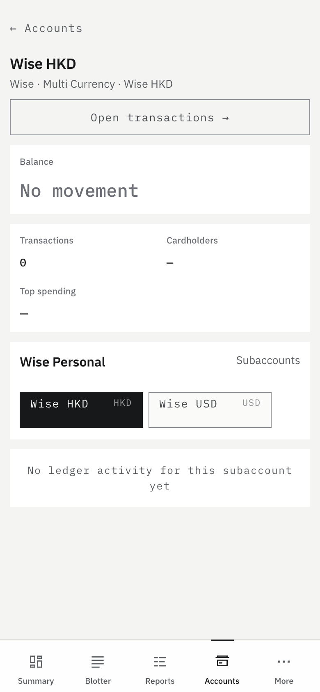 |

| Reports chart entry | Settings |
|---|---|
| 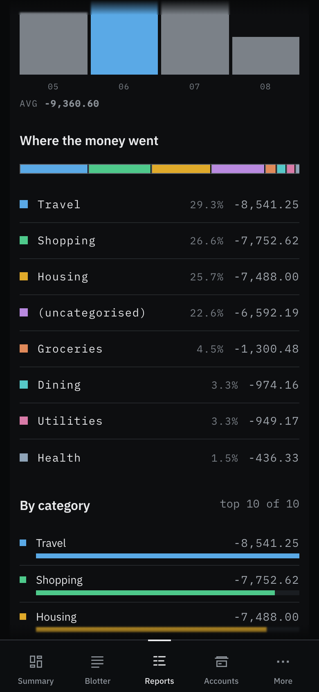 |  |

| Advanced settings | Light settings |
|---|---|
| 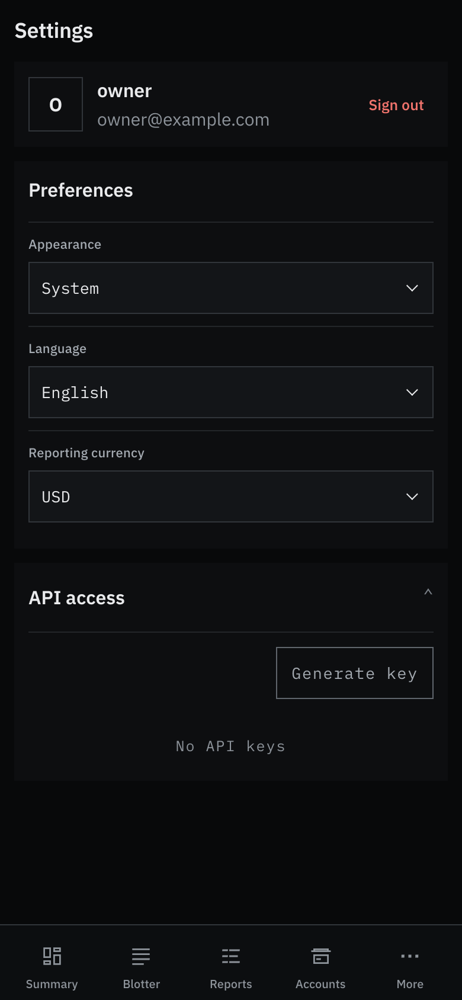 | 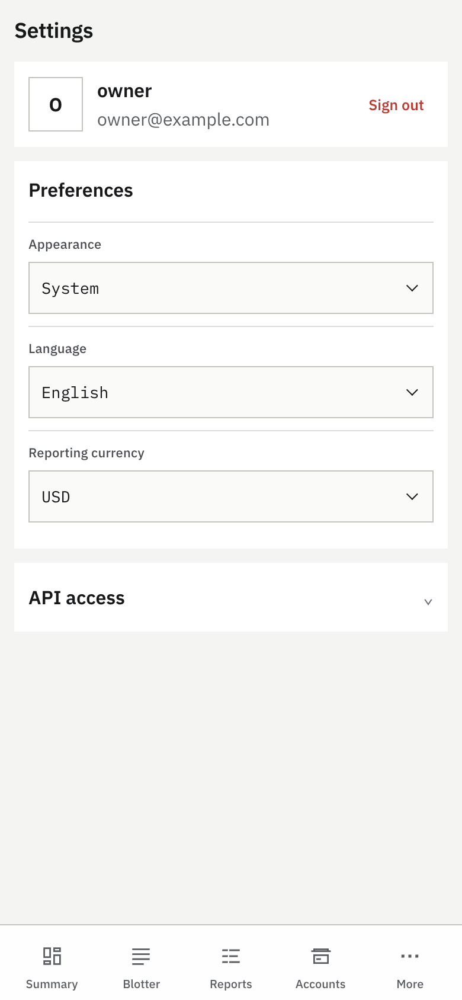 |

| Desktop transaction detail |
|---|
| 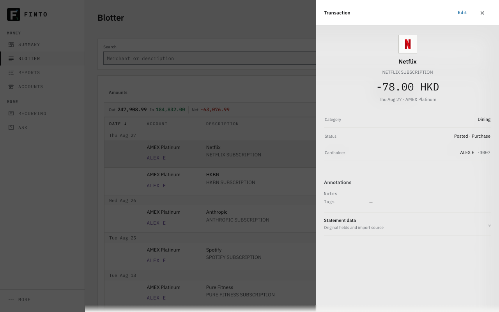 |

| Light mobile | Desktop accounts |
|---|---|
| 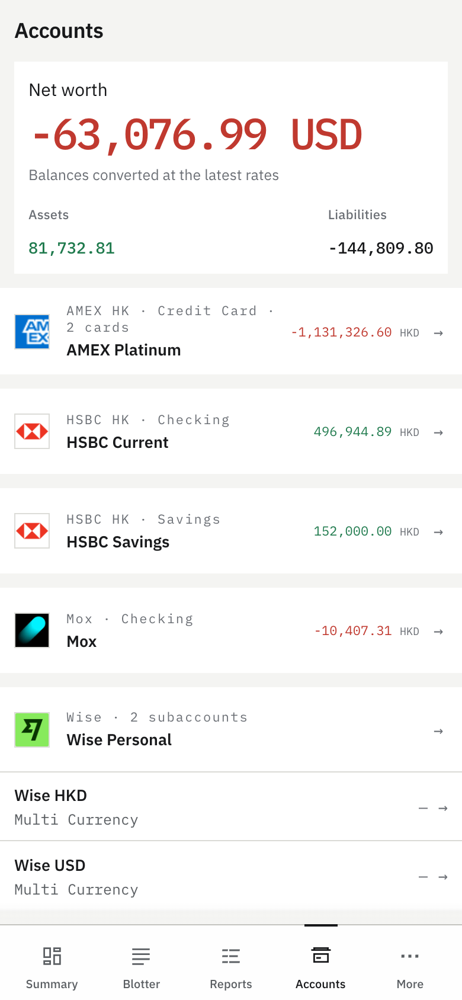 | 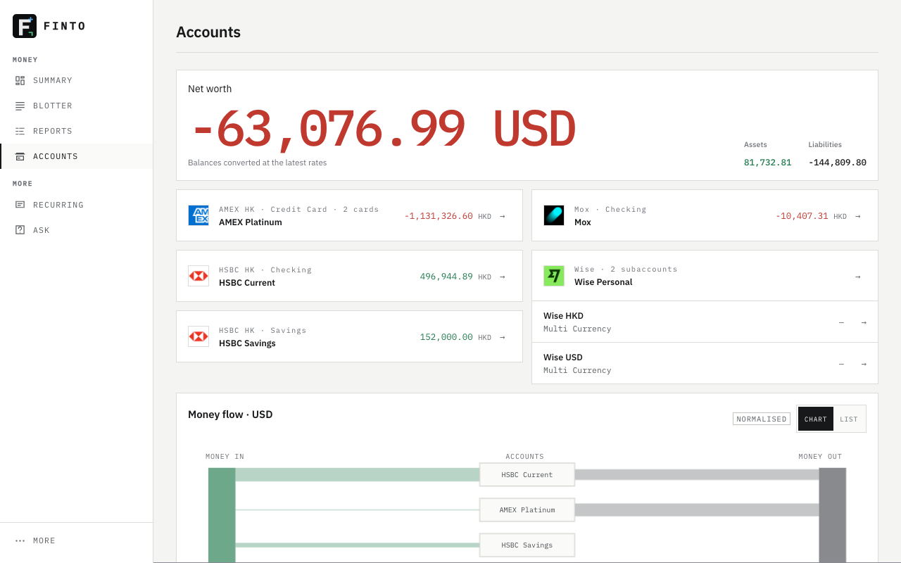 |
